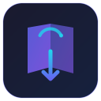

# BlackBoard Sync

<p align="center">
  
</p>

<p align="center">
  
  
  
  <a href="LICENSE"></a>
</p>

App desktop per sincronizzare automaticamente i file dei corsi dalla piattaforma Blackboard dell'**Università Bocconi** direttamente sul tuo computer.

---

## Funzionalità

- **Login SSO Bocconi** — autenticazione SAML2 tramite Shibboleth IDP, le credenziali vengono salvate in modo sicuro con `safeStorage` di Electron
- **Sincronizzazione file** — scansiona tutti i corsi e scarica automaticamente gli allegati mancanti con controllo della concorrenza
- **Nomi docenti** — mostra i professori e i direttori di corso accanto a ogni insegnamento
- **Filtro per semestre** — filtra i corsi per semestre con pill selezionabili
- **Rinomina corsi** — assegna alias personalizzati alle cartelle dei corsi
- **Selezione corsi** — scegli quali corsi sincronizzare
- **Sincronizzazione automatica** — intervallo configurabile (30m, 1h, 2h) o programmata a un orario specifico (es. mezzanotte)
- **Riepilogo sync** — modale con dettaglio dei file scaricati per ogni corso
- **Pannello impostazioni** — accessibile dall'icona ⚙️ nell'header
- **Minimizza nel tray** — l'app resta attiva nella system tray anche chiudendo la finestra
- **Avvio con Windows** — avvia l'app automaticamente all'accesso
- **Notifiche desktop** — notifica al completamento della sincronizzazione
- **Aggiornamento automatico** — l'app si aggiorna automaticamente tramite GitHub Releases
- **Installer nativo** — setup `.exe` per Windows e `.dmg` per macOS
- **Portabile** — versione `.zip` senza installazione per tutte le piattaforme

## Screenshot

<p align="center">
  
</p>

## Installazione

Scarica l'ultima release dalla pagina [Releases](../../releases).

| Piattaforma | Installer (setup) | Portable (no install) |
|-------------|--------------------|-----------------------|
| **Windows** | `BlackBoardSync-x.x.x Setup.exe` | `BlackBoard Sync-win32-x64-x.x.x.zip` |
| **macOS** | `BlackBoard Sync-x.x.x.dmg` | `BlackBoard Sync-darwin-x64-x.x.x.zip` |

### Windows

- **Installer:** esegui il `.exe` e segui il wizard — l'app viene installata e aggiunta al menu Start
- **Portable:** estrai lo `.zip` in una cartella qualsiasi e avvia `BlackBoard Sync.exe`

> **Nota:** Windows potrebbe mostrare un avviso SmartScreen al primo avvio. Clicca su "Ulteriori informazioni" → "Esegui comunque".

### macOS

- **Installer:** apri il `.dmg` e trascina l'app nella cartella Applicazioni
- **Portable:** estrai lo `.zip` e avvia l'app

## Sviluppo

### Prerequisiti

- [Node.js](https://nodejs.org/) 18+
- npm 9+

### Setup

```bash
git clone https://github.com/Clav3rbot/BlackBoardSync.git
cd BlackBoardSync
npm install
```

### Comandi

| Comando | Descrizione |
|---------|-------------|
| `npm start` | Avvia l'app in modalità sviluppo |
| `npm run make` | Crea i pacchetti distribuibili (installer + zip) |

### Struttura progetto

```
src/
├── index.ts                    # Main process (Electron)
├── preload.ts                  # Context bridge (IPC)
├── renderer.tsx                # Entry point renderer
├── types.d.ts                  # Tipi TypeScript condivisi
├── index.html                  # HTML template
├── client/
│   ├── App.tsx                 # Root component
│   └── components/
│       ├── LoginView.tsx       # Schermata di login
│       ├── SyncView.tsx        # Schermata principale
│       ├── Header.tsx          # Header con avatar e sync
│       ├── CourseList.tsx       # Lista corsi con filtri
│       ├── SettingsView.tsx    # Pannello impostazioni
│       └── SyncResultModal.tsx # Modale risultato sync
├── modules/
│   ├── blackboard.ts           # Client API Blackboard REST
│   ├── download.ts             # Download manager con concorrenza
│   ├── login.ts                # Flusso SSO SAML2 Bocconi
│   └── store.ts                # Persistenza configurazione
└── styles/
    └── main.scss               # Stili (dark theme, glassmorphism)
```

## Stack tecnologico

- **Electron 28** + Electron Forge 7
- **TypeScript 5.3**
- **React 18** — UI dichiarativa
- **SCSS** — dark theme con glassmorphism e gradient
- **Webpack** — bundling
- **axios** — chiamate HTTP
- **cheerio** — parsing HTML per il flusso SAML
- **GitHub API** — aggiornamenti automatici tramite GitHub Releases

## Disclaimer

Questa applicazione **non è affiliata, associata o approvata dall'Università Bocconi** in alcun modo. È uno strumento indipendente creato per velocizzare il download dei documenti dalla piattaforma Blackboard.

Le credenziali inserite vengono salvate localmente sul dispositivo dell'utente tramite `safeStorage` di Electron e non vengono mai trasmesse a terzi. Il creatore dell'app **non è in alcun modo responsabile** dell'uso, della gestione o della sicurezza delle credenziali inserite dall'utente.

L'utilizzo dell'app è a proprio rischio e pericolo.

## Licenza

[GPL-3.0](LICENSE)
