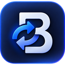

# BlackBoard Sync

<p align="center">
  
</p>

<p align="center">
  
  
  
  
  <a href="LICENSE"></a>
  <a href="https://github.com/Clav3rbot/BlackBoardSync/releases/latest"></a>
</p>

**BlackBoard Sync** è una semplice app che serve per tenere sincronizzati tutti i tuoi file di Blackboard, user-friendly e senza compromessi.

Sto sviluppando quest'app come strumento ad uso personale, ma ho pensato potesse essere utile ad altri studenti, perciò è completamente opensource e gratuita sotto [licenza GPLv3](LICENSE).

---

## Cos'è esattamente?

BlackBoard Sync nasce come strumento complementare a Blackboard Learn dell'**Università Bocconi**, visto che la piattaforma non offre un modo semplice per scaricare e mantenere aggiornati tutti i materiali dei corsi. Punta a essere una soluzione completa e definitiva: l'obiettivo è avere qualcosa che puoi avviare e dimenticartene, essendo sicuro che tutti i file di Blackboard saranno sempre aggiornati.

## A cosa serve?

Serve per tenere sincronizzati i propri file di Blackboard in una cartella locale sul proprio PC. Se vuoi un'esperienza senza pensieri, puoi lasciare che l'app si apra in background e scegliere ogni quanto avverranno le sincronizzazioni, così da avere sempre tutti i file aggiornati. Oppure puoi disattivare l'autosync e scaricare tutti i file in una volta sola quando preferisci.

---

## Funzionalità

- **Login SSO Bocconi** - autenticazione SAML2 tramite Shibboleth IDP, le credenziali vengono salvate in modo sicuro tramite il Keyring nativo di sistema (Windows Credential Manager / macOS Keychain) con azzeramento della memoria (`zeroize`)
- **Sincronizzazione file** - scansiona tutti i corsi e scarica automaticamente gli allegati mancanti con controllo della concorrenza
- **Nomi docenti** - mostra i professori e i direttori di corso accanto a ogni insegnamento
- **Filtro per semestre** - filtra i corsi per semestre con pill selezionabili
- **Rinomina corsi** - assegna alias personalizzati alle cartelle dei corsi
- **Selezione corsi** - scegli quali corsi sincronizzare
- **Sincronizzazione automatica** - intervallo configurabile (30m, 1h, 2h) o programmata a un orario specifico (es. mezzanotte)
- **Riepilogo sync** - modale con dettaglio dei file scaricati per ogni corso
- **Pannello impostazioni** - accessibile dall'icona ⚙️ nell'header
- **Minimizza nel tray** - l'app resta attiva nella system tray anche chiudendo la finestra
- **Avvio con Windows/macOS** - avvia l'app automaticamente all'accesso
- **Notifiche desktop** - notifica al completamento della sincronizzazione
- **Aggiornamento automatico** - l'app si aggiorna automaticamente tramite GitHub Releases (firmato crittograficamente con chiavi Ed25519)
- **Installer nativo** - setup `.exe` per Windows e `.dmg` per macOS

## Screenshot

<p align="center">
  
</p>

## Installazione

Scarica l'ultima release dalla pagina [Releases](../../releases).

| Piattaforma | Installer |
|-------------|-----------|
| **Windows** | `BlackBoard_Sync_x.x.x_x64-setup.exe` |
| **macOS** | `BlackBoard_Sync_x.x.x_universal.dmg` |

---

## Sviluppo

### Prerequisiti

- [Node.js](https://nodejs.org/) 18+
- Rust e compilatore di sistema (MSVC su Windows, Xcode CLI su macOS)
- npm 9+

### Setup

```bash
git clone https://github.com/Clav3rbot/BlackBoardSync.git
cd BlackBoardSync
npm install
```

### Comandi

| Comando | Descrizione |
|---------|-------------|
| `npm run tauri dev` | Avvia l'app in modalità sviluppo |
| `npm run tauri build` | Crea i pacchetti distribuibili (installer) |

### Struttura progetto

```
src/                            # Frontend (React)
├── index.html                  # HTML template
├── renderer.tsx                # Entry point renderer
├── tauri-api.ts                # Bridge API per chiamare Rust
├── client/
│   ├── App.tsx                 # Root component
│   └── components/             # Componenti UI (Login, Sync, Settings, ecc.)
└── styles/
    └── main.scss               # Stili (dark theme, glassmorphism)

src-tauri/                      # Backend (Tauri & Rust)
├── Cargo.toml                  # Dipendenze Rust
├── tauri.conf.json             # Configurazione Tauri (capabilities, updater, ecc.)
└── src/
    ├── main.rs                 # Inizializzazione app e plugin
    ├── commands.rs             # Comandi Tauri invocabili dal frontend
    ├── blackboard.rs           # Client API Blackboard
    ├── login.rs                # Autenticazione SSO Bocconi (SAML)
    ├── download.rs             # Gestore download e sincronizzazione
    ├── store.rs                # Persistenza configurazione e Keyring
    ├── state.rs                # Stato condiviso in memoria
    ├── tray.rs                 # Configurazione system tray
    └── updater.rs              # Gestione aggiornamenti crittografati
```

## Stack tecnologico

- **Tauri v2** + **Rust** - per il backend nativo ultraleggero
- **TypeScript 5.3**
- **React 19** - UI dichiarativa
- **SCSS** - dark theme con glassmorphism e gradienti
- **Webpack** - bundling frontend
- **reqwest** - client HTTP asincrono in Rust
- **scraper** - parsing HTML in Rust per il flusso SAML
- **keyring-rs** - accesso sicuro al portachiavi di sistema
- **zeroize** - pulizia sicura della memoria per le credenziali

## Disclaimer

Questa applicazione **non è affiliata, associata o approvata dall'Università Bocconi** in alcun modo. È uno strumento indipendente creato per velocizzare il download dei documenti dalla piattaforma Blackboard.

Le credenziali inserite vengono salvate localmente sul dispositivo dell'utente tramite i meccanismi nativi del sistema operativo (Credential Manager/Keychain) e non vengono mai trasmesse a terzi. Il creatore dell'app **non è in alcun modo responsabile** dell'uso, della gestione o della sicurezza delle credenziali inserite dall'utente.

L'utilizzo dell'app è a proprio rischio e pericolo.

## Licenza

[GPL-3.0](LICENSE)
